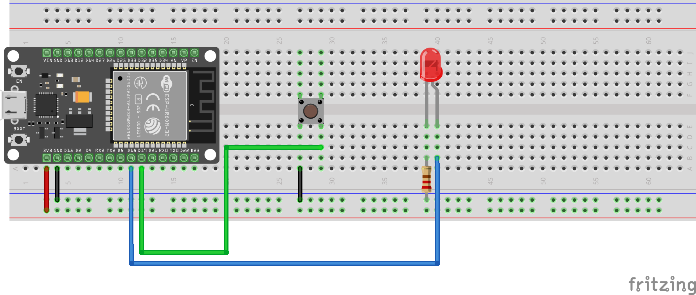

# Push Button

## Pull-Down Resistor

Pull-down resistor connects BUTTON_PIN (D19) to GND (LOW) when button is not pressed.


## Pull-Up Resistor

Pull-up resistor connects BUTTON_PIN (D19) to Vcc (HIGH) when button is not pressed.


## Internal Pull-Up Resistor

Internal pull-up resistor internally connects BUTTON_PIN (D19) to Vcc (HIGH) when button is not pressed. When configuring the BUTTON_PIN with `pinMode()`, use `INPUT_PULLUP` mode:

```cpp
pinMode(BUTTON_PIN, INPUT_PULLUP);
```


